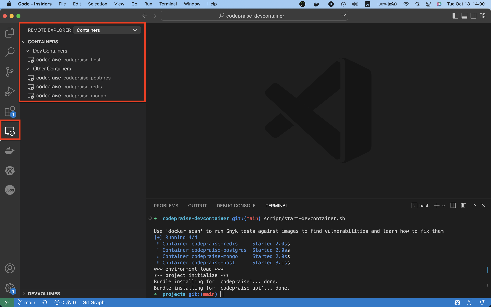
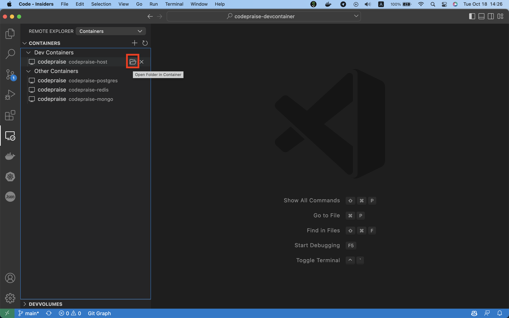
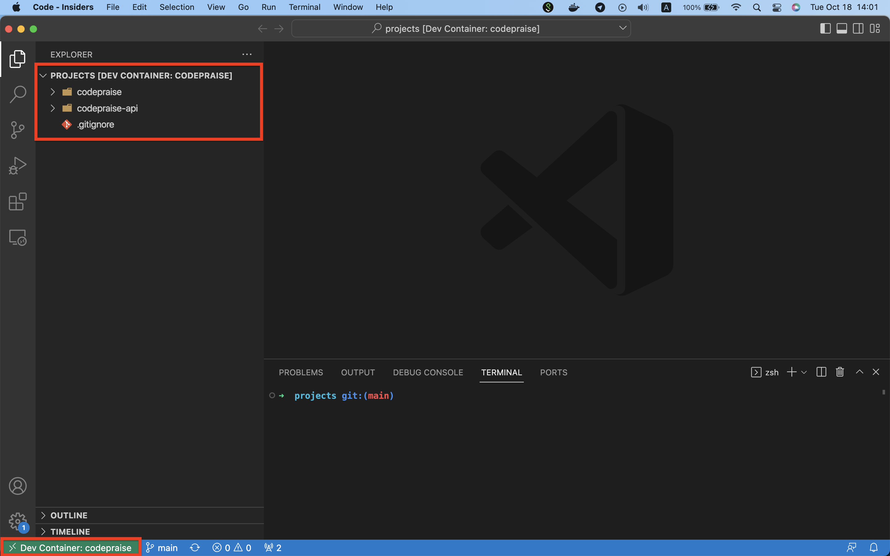
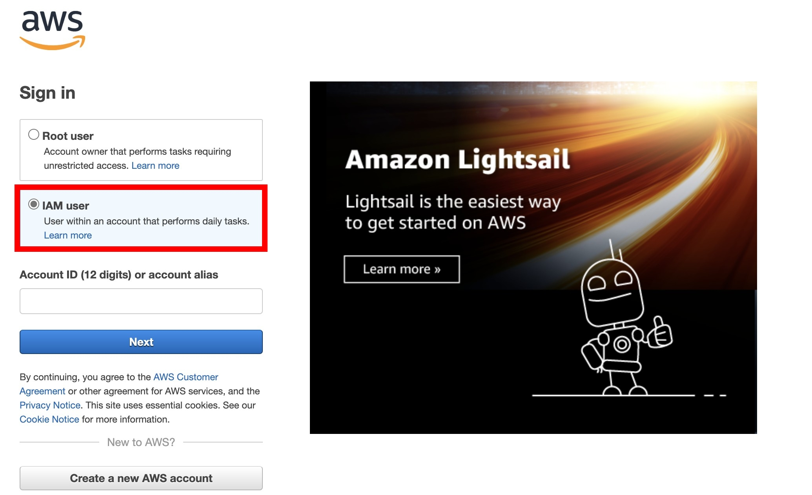
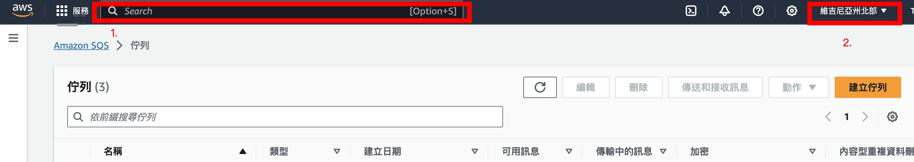
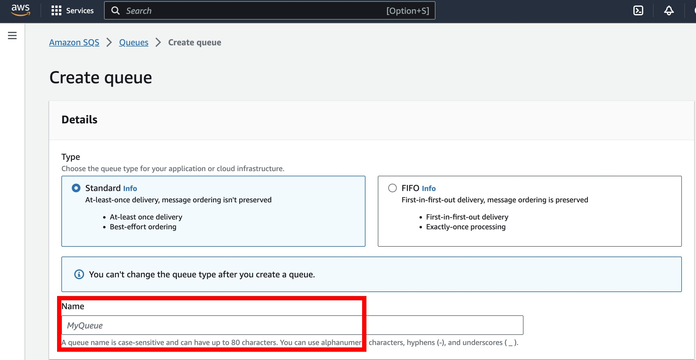
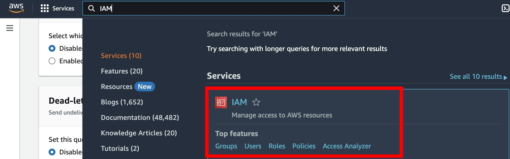
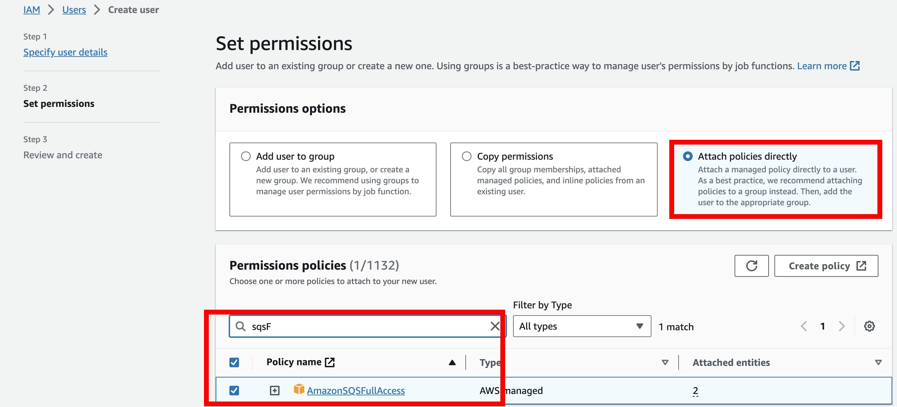

# CodePraise DevContainer
Environment setup is always a nightmare for a new member who has just onboard to the project. It takes time to install all the necessary tools, compiler or interpreter, version control system, or database. Therefore, a DevContainer can standardize the developing environment for developers to start working on a new project in a short time.

## Installation
Clone this repo to your working machine which has already installed docker.

## Usage
### Accessorize the DevContainer Shell
You can customize your shell environment. Copy `.devcontainer/profile_example.sh` then rename to  `.devcontainer/profile.sh`, this file will not be tracked in version control, so each developer can customize their login shell. For now, you can add some commands in `.devcontainer/profile.sh`, like `alias`.

#### Oh-My-Zsh Decoration
We adopt `zsh` as the default shell, and support `Oh-My-Zsh`. You will have to copy `.devcontainer/zsh_config_example.yml` and then change the file name to `zsh_config.yml` for the first time you just clone this repo. 
`zsh_config.yml` will not be added to version control, therefore, every developer can customize its shell by specifying the `theme` and `plugins` in this file.

[How to Setup ZSH Config](.devcontainer/ZSH_README.md)

### Start the DevContainer
Run the `start-devcontainer.sh` to start the DevContainer and login to the shell.
```
script/start-devcontainer.sh
```
It will automatically clone all the projects we specified from `project_github_urls` in `config.yml`. Also execute `bundle install` for all projects.

#### Get Another Shell in the DevContainer
You can get another shell in the DevContainer by opening a new terminal then run the `start-devcontainer.sh`

[VS Code DevContainer Extension](#vs-code-devcontainer-extension)

#### Working Directory
After logging into the DevContainer shell, the working directory will be `~/workspace/projects`, this is the place where we cloned the project.
```
-- workspace
   |-- projects
   |    |-- codepraise
   |    |   |-- ...
   |    |-- codepraise-api
   |    |   |-- ...
   |    |-- ...
   |-- ...   
```

#### Architecture of the DevContainer
The DevContainer will start all the services we need as containers. 
* `host` is the container with the development environment setup already.
* `mongo`, `postgres`, and `redis` are containers with databases setup.
```
NAME                  COMMAND                  SERVICE             STATUS              PORTS
codepraise-host       "sleep infinity"         host                running             0.0.0.0:9090->9090/tcp, 0.0.0.0:9292->9292/tcp
codepraise-mongo      "docker-entrypoint.s…"   mongo-db            running             0.0.0.0:27017->27017/tcp
codepraise-postgres   "docker-entrypoint.s…"   postgres-db         running             0.0.0.0:5432->5432/tcp
codepraise-redis      "docker-entrypoint.s…"   redis-db            running             0.0.0.0:6379->6379/tcp
```

### Stop the DevContainer
Run the `stop-devcontainer.sh` to stop the DevContainer.
```
script/stop-devcontainer.sh
```

All the services will be stopped, and can be started again by running the `start-devcontainer.sh`.

### Remove the DevContainer
Run the `remove-devcontainer.sh` to remove the DevContainer.
```
script/remove-devcontainer.sh
```

All the services will be removed, it will create a whole new DevContainer environment if you run `start-devcontainer.sh` after removing the DevContainer. Therefore, only remove the DevContainer if you want to reset the environment, or if there are some changes to the setting of DevContainer in `.devcontainer/docker-compose.yml` or `.devcontainer/Dockerfile`.

> **Note**
> 
> If it fails to remove or stop the container, try to restart docker then remove or stop it again.

## Data Storage
Some folders on our local machine are mapped to containers for caching data storage, so that the data won't be lost even if we remove the DevContainer.

### Project
The `projects` folder on our local machine is mapped to the `~/workspace/projects/` in the `host` container. So we can edit them on our local machine directly, and it will synchronize to the `host` container automatically.
```
-- codepraise-devcontainer
   |-- projects
   |   |-- codepraise
   |   |   |-- ...
   |   |   codepraise-api
   |   |   |-- ...
   |-- ...
```

### Database
All the database (redis, mongo, postgres) data folders will be mapped in the `db-data` folder on our local machine.
```
-- codepraise-devcontainer
   |-- db-data
   |   |-- mongo
   |   |   |-- ...
   |   |-- postgres
   |   |   |-- ...
   |   |-- redis
   |   |   |-- ...
   |-- ...
```

### Gem Packages
The gem package data will only be stored in the `host` container, since it will lower the running speed of the program in the `host` container if we want to read/write them from the local machine. 
Therefore, everytime you run the `start-devcontainer.sh` to start the DevContainer and login to the shell, it will execute `bundle install` command to install gem packages automatically.

## VS Code DevContainer Extension
VS Code has an [extension](https://marketplace.visualstudio.com/items?itemName=ms-vscode-remote.remote-containers) for DevContainer allowing developers to connect to the DevContainer and work inside the container directly.

### Adding a definition for the DevContainer
You will have to provide a definition for the DevContainer in `.devcontainer/devcontainer.json` to let the extension know how to start connecting the DevContainer. Yet you don't have to add this by yourselves since it will be generated automatically once you execute the `script/start-devcontainer.sh`. This definition file will not be tracked in the version control, because it will be a bit different for each developer.

### Connect to the DevContainer
Once you install the extension, you can click the icon of this extension, and you will see a list of container you have.


The host container is the one we will connect, it will show a folder icon when you move the mouse pointer to it. Click the folder icon to connect to the host container.


If you connect to the DevContainer successfully, you will see your project folders.


### Set up AWS SQS Service for worker in Codepraise-api.

When we attempt to run CodePraise, we need to replace certain tokens in the secret.yml file. One of the most critical setups is the SQS service, as it directly affects the usage of workers.

1. Login [AWS](https://signin.aws.amazon.com/signin?redirect_uri=https%3A%2F%2Fconsole.aws.amazon.com%2Fconsole%2Fhome%3FhashArgs%3D%2523%26isauthcode%3Dtrue%26state%3DhashArgsFromTB_ap-southeast-2_f0f961ef2b42dff4&client_id=arn%3Aaws%3Asignin%3A%3A%3Aconsole%2Fcanvas&forceMobileApp=0&code_challenge=koB4iW2c_PuWNp6eO1klqErpW-HGUIYN8kAnMIMF4sA&code_challenge_method=SHA-256) and choose "IAM user", if you don't have an account, create a new one.


2. Search for 'SQS Service' using the search box at the top. Once you arrive on the same page as shown below, select 'us-east-1' as the server location on top-right. Finally, click 'Create queue' to create a new queue for the worker.


3. You don't need to configure anything except for the name of the queue. Simply click 'Create queue' to complete the creation process.
 

4. Now you have to give yourself the permission to use the queue you just created. Search for 'IAM' using the search box at the top. Choose the "Users" on the Dashboard on the left side, and click the "Create user" bottom to create a new user.
 

5. After giving the user name in the first step, you need to set-up something as the screenshot below: choose "Attach policies directly" and add "AmazonSQSFullAccess" to the Permissions policies.
 

6. We're almost there! After completing all the steps above, you should have obtained "AWS_ACCESS_KEY_ID" and "AWS_SECRET_ACCESS_KEY" from the IAM page, and the "AWS_REGION" should be set to 'us-east-1' (you can change it as needed). 'CLONE_QUEUE' is the name of the queue you set during step 3, and the same goes for 'CLONE_QUEUE_URL'.

Enjoy using CodePraise!


> **Note**
> 
> The extension now only supports opening one editing window for DevContainer but allows you to open multiple terminals. Therefore, you will have to open multiple terminals and switch to your project folder if you have multiple projects and want to run them up simultaneously.

